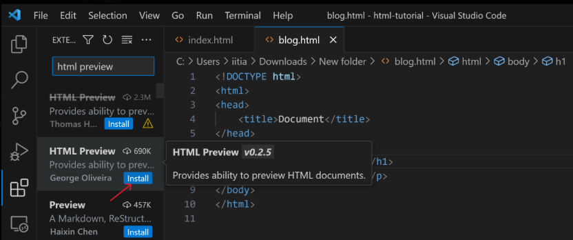
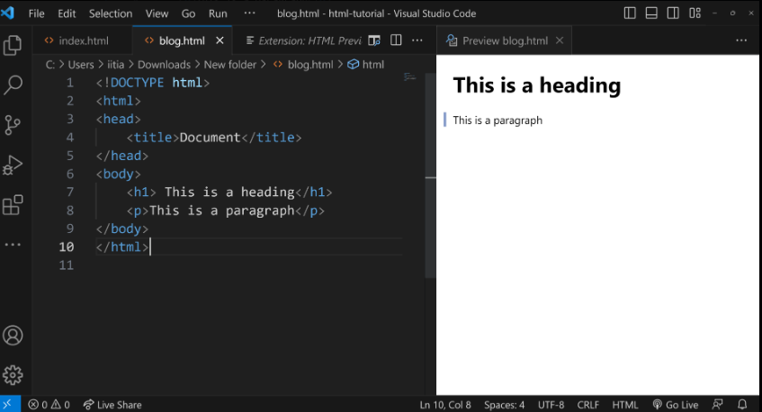

# HTML Execution

## our Journey to Creating Your First Website Begins Here!
Let's mark this as an important milestone: the creation of your first website! And what's a better way to start than with the traditional "Hello, World!"?

## Why "Hello, World!"?
In the programming world, "Hello, World!" is more than just a phrase. It's a tradition, an emotion, a simple program that teaches you the syntax and gets you started. And guess what? HTML is no different!

Our first website will display the text 'Hello World'

## Let's Get Started: Setting Up Your VS Code
If you haven't already set up your environment, let's begin by opening Visual Studio Code (VS Code).

VS Code Open

### Creating a New File
Click on "Open Folder" and open a folder somewhere on your computer. I am opening a folder named html-tutorial.

Once VS Code is open, you'll want to create a new file:

Click on the "New File" icon in VS Code.
Type the filename as "index.html" and hit Enter.
Video Tutorial

### Pasting the Code
Now that your file is ready, copy the following code and paste it into your "index.html" file.
```html
<!DOCTYPE html>
<html lang="en">
<head>
    <meta charset="UTF-8">
    <meta name="viewport" content="width=device-width, initial-scale=1.0">
    <title>Document</title>
</head>
<body>
    Hello World
</body>
</html>
```

### Going Live using the "live server" extension
To see your webpage in action, locate the "Go Live" icon at the bottom-right corner of your VS Code window and click it. If you don't see this icon, you probably haven't installed the Live Server extension, which we discussed in a previous tutorial.



Go Live

### Your First Website is Live!
Congratulations! If you've followed along, you should now see your very first website displaying the classic "Hello, World!" message.


## Live Preview Extension
Another useful extension for working with HTML in VS Code is 'HTML Preview.' To install it, simply click on the extensions icon in VS Code and type 'HTML Preview' in the search bar. Install it!


HTML Preview Extension

Now, you will see a button within VS Code. Clicking on this button will allow you to preview your HTML right within the editor.


Once you click the button, you'll see a live preview of your HTML directly within VS Code.




You don't even need a browser to render plain HTML. This live preview feature in VS Code is perfect for this HTML tutorial, allowing you to build and preview your entire HTML website without ever leaving the editor.