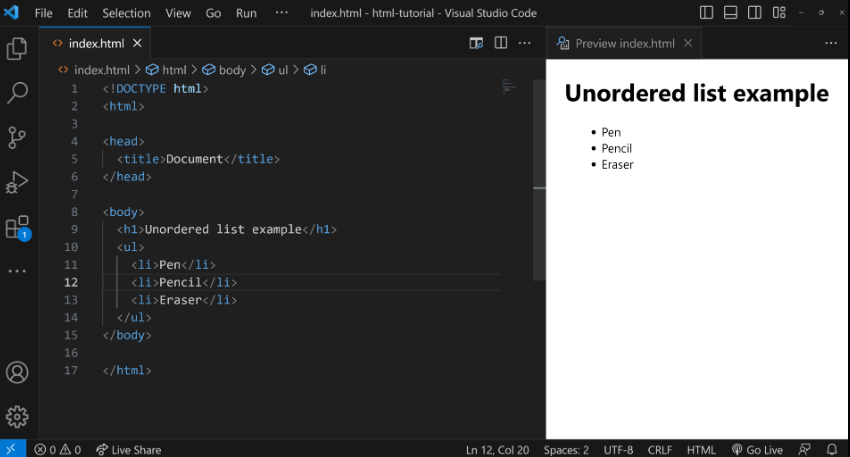
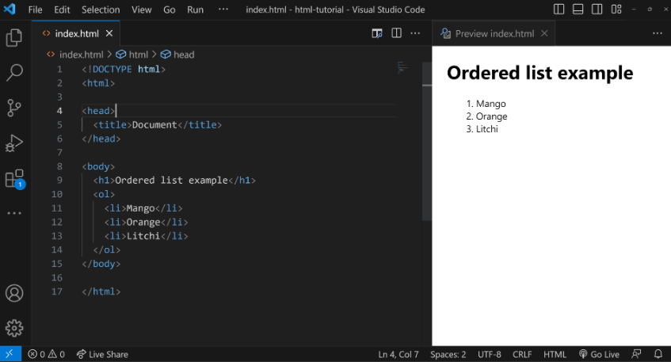
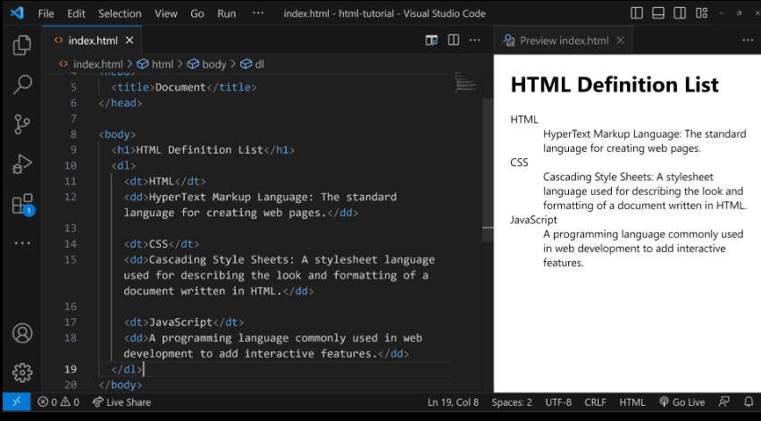
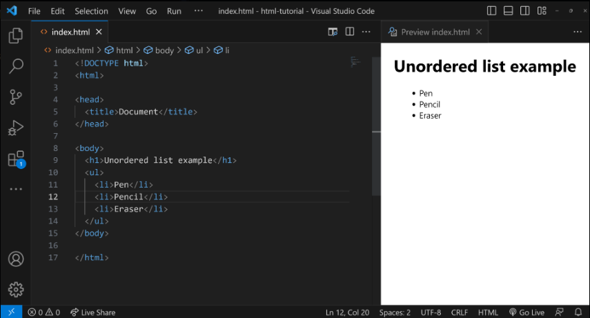
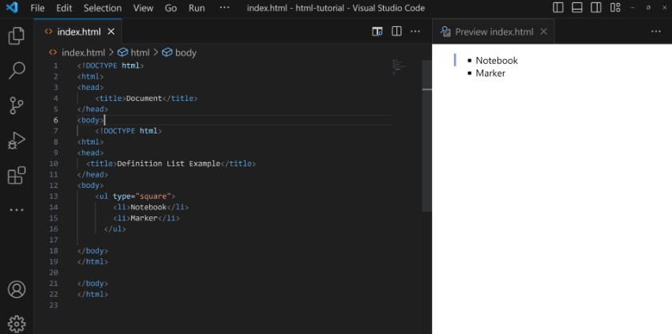

# HTML Lists
Our day-to-day lives often involve the use of lists. For example, when we go shopping, the bill we receive includes a list of all the items we've purchased. In a similar manner, web developers use lists to neatly display data on websites.

## Types of HTML Lists
HTML provides different types of lists to display data in various forms. Each list contains one or more list items.

- Unordered List: Displays items using bullets.
Ordered List: Displays items in a - numerical sequence, and supports various numbering styles like Arabic numerals, Roman numerals, and so on.
- Definition List: Organizes items in a format similar to a dictionary, with terms and their corresponding definitions.

## An Unordered List
An unordered list uses bullets to display items. It is suitable for listing items where the order doesn't matter. We will soon explore unordered lists in great detail.



## An Ordered List
An ordered list uses numbers or other types of markers to indicate the sequence of items. It's ideal for listing steps in a process or ranking items in order of importance. We will soon explore ordered lists in great detail.


## A Definition List
A definition list arranges items in a way similar to a dictionary, with a term followed by its definition. This is useful for glossaries or to display metadata.



## HTML Unordered List
An unordered list is a list of items that are not arranged in any specific, sequential order. Unlike ordered lists, the items in an unordered list are typically marked with bullet points, dashes, or other symbols to indicate list membership, but these markers do not imply any particular order.

## Syntax for Creating Unordered Lists

### Key Characteristics of Unordered Lists
- No specific sequence is required.
- Typically displayed as bullet points.
- Defined using the <ul> tag.
- Individual items use the <li> tag.

### Basic Example
```html
<ul>
    <li>Pen</li>
  <li>Pencil</li>
  <li>Eraser</li>
</ul>
```

##### Output
- Pen
- Pencil
- Eraser



#### Customizing Bullet Points with 'type' Attribute
You can specify the style of bullet points using the `type` attribute. It supports three values:

- disc - default bullet style
- square
- circle

### Example Using Square Bullets:
```html
<ul type="square">
    <li>Notebook</li>
  <li>Marker</li>
</ul>
```

**Output:**




## HTML Ordered List
An ordered list is a list of items that are arranged in a specific, sequential order. Each item in the list is usually numbered to indicate its position in the sequence. Ordered lists are commonly used when the sequence of the items is important, such as in step-by-step instructions or rankings.

### Syntax


### Key Points
- Ordered lists are used for items that follow a sequence.
- They are created using the <ol> (Ordered List) tag.
- List items are enclosed within <li> (List Item) tags.

### Basic Example
```html
<ol>
  <li>Mango</li>
  <li>Orange</li>
  <li>Litchi</li>
</ol>
```
**Output:**
1. Mango
2. Orange
3. Litchi

### Setting the 'type' Attribute
The `type` attribute specifies the style of numbering. You have several options:

Uppercase Roman Numerals: Use `type="I"`
Lowercase Roman Numerals: Use `type="i"`
Arabic Numerals: Use `type="1"` (This is the default if the `type` attribute is not specified)
Lowercase Alphabetical Letters: Use `type="a"`
Uppercase Alphabetical Letters: Use `type="A"`
Setting the 'start' Attribute
The start attribute specifies the starting number for the list.
```html
<ol type="A" start="3">
    <li>Pen</li>
  <li>Pencil</li>
</ol>
```
**Output:**
3. Pen
4. Pencil


## HTML Definition Lists
A Definition List in HTML is used to represent a list of terms along with their corresponding descriptions or definitions. The Definition List is created using the `<dl>` (Definition List) element, which wraps around one or more pairs of `<dt>` (Definition Term) and  `<dd>` (Definition Description) elements.


## Definition List Example
Here's a simple example to illustrate:
```html
<h1>HTML Definition List</h1>
<dl>
    <dt>HTML</dt>
  <dd>HyperText Markup Language: The standard language for creating web pages.</dd>
 
  <dt>CSS</dt>
  <dd>Cascading Style Sheets: A stylesheet language used for describing the look and formatting of a document written in HTML.</dd>
 
  <dt>JavaScript</dt>
  <dd>A programming language commonly used in web development to add interactive features.</dd>
</dl>
```
Understanding the example

In this example:

- `<dl>` is the container for the list.
- `<dt>` defines the terms that you want to explain.
- `<dd>` contains the definitions or explanations for the terms.


This creates a clean, organized way to present a list of terms and their corresponding definitions, much like a glossary or dictionary.`