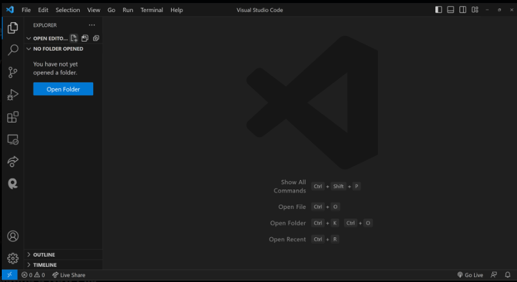
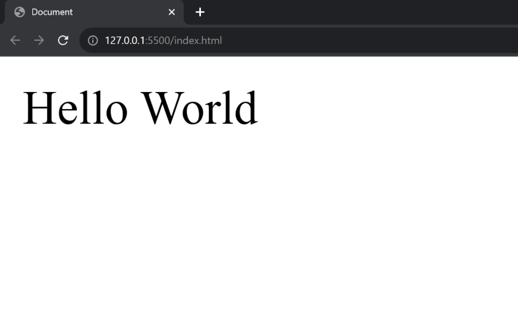
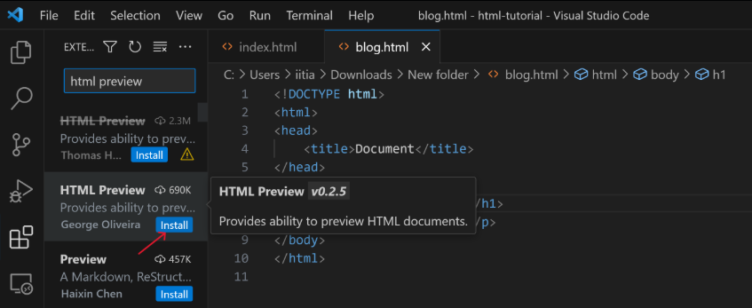

# HTML Execution
## Your Journey to Creating Your First Website Begins Here!
Let's mark this as an important milestone: the creation of your first website! And what's a better way to start than with the traditional "Hello, World!"?

## Why "Hello, World!"?
In the programming world, "Hello, World!" is more than just a phrase. It's a tradition, an emotion, a simple program that teaches you the syntax and gets you started. And guess what? HTML is no different!

Our first website will display the text 'Hello World'

## Let's Get Started: Setting Up Your VS Code
If you haven't already set up your environment, let's begin by opening [Visual Studio Code (VS Code)](https://code.visualstudio.com/download).




### Creating a New File
Click on "Open Folder" and open a folder somewhere on your computer. I am opening a folder named html-tutorial.

Once VS Code is open, you'll want to create a new file:

1. Click on the "New File" icon in VS Code.
2. Type the filename as "index.html" and hit Enter.


#### Pasting the Code
Now that your file is ready, copy the following code and paste it into your "index.html" file.
```html
<!DOCTYPE html>
<html lang="en">
<head>
    <meta charset="UTF-8">
    <meta name="viewport" content="width=device-width, initial-scale=1.0">
    <title>Document</title>
</head>
<body>
    Hello World
</body>
</html>
```

#### Going Live using the "live server" extension
To see your webpage in action, locate the "Go Live" icon at the bottom-right corner of your VS Code window and click it. If you don't see this icon, you probably haven't installed the Live Server extension, which we discussed in a previous tutorial.


Your First Website is Live!
Congratulations! If you've followed along, you should now see your very first website displaying the classic "Hello, World!" message.




### Live Preview Extension
Another useful extension for working with HTML in VS Code is 'HTML Preview.' To install it, simply click on the extensions icon in VS Code and type 'HTML Preview' in the search bar. Install it!



Now, you will see a button within VS Code. Clicking on this button will allow you to preview your HTML right within the editor.


Once you click the button, you'll see a live preview of your HTML directly within VS Code.


You don't even need a browser to render plain HTML. This live preview feature in VS Code is perfect for this HTML tutorial, allowing you to build and preview your entire HTML website without ever leaving the editor.HTML Id & Classes
HTML offers multiple ways to select and style elements. Two of the most commonly used selectors are IDs and Classes. This blog explores what they are, how to use them, and their differences.

What is an ID?
An ID is an attribute, a unique identifier assigned to only one HTML element within a page. It is often used for unique styling and JavaScript manipulations.

<div id="myUniqueID">This is a div with an ID.</div>

What are Classes?
The class attribute lets you give the same name to multiple HTML elements. That way, you can easily change their look or behavior all at once. Classes are not unique and can be assigned to multiple elements. They are generally used for applying the same styles or behaviors to a group of elements.

<div class="myClass">This is a div with a class.</div>
<p class="myClass">This is a paragraph with the same class.</p>

The Style Tag
The style tag in HTML is used to include embedded CSS (Cascading Style Sheets) within an HTML document. It is commonly placed within the <head> section of the HTML file, although it can technically be used in the <body> as well. The style tag allows you to define the look and feel of various HTML elements on the page, including their colors, sizes, margins, and other visual styles.

Here's a simple example:

<!DOCTYPE html>
<html>
<head>
  <style>
    /* CSS rules go here */
    p {
      color: blue;
      font-size: 18px;
    }
    .highlight {
      background-color: yellow;
    }
  </style>
</head>
<body>
  <p>This is a blue paragraph.</p>
  <p class="highlight">This paragraph has a yellow background.</p>
</body>
</html>

In this example, we have targeted the second paragraph by its class name in CSS. The style tag is used to add CSS right into HTML. We will learn about CSS and selectors later in the CSS tutorial.

Using IDs and Classes in CSS
In CSS, elements with IDs are selected using a hash (#) symbol before the ID, and elements with classes are selected using a dot (.) before the class name.

/* CSS for ID */
#myUniqueID {
  background-color: yellow;
}
 
/* CSS for Class */
.myClass {
  font-size: 18px;
}

Differences Between IDs and Classes
Uniqueness: IDs are unique, and classes can be reused.
JavaScript: IDs are often used for JavaScript operations.
Styling: Both can be used for styling, but IDs have higher specificity.
Conclusion
Understanding the difference between IDs and Classes is crucial for effective web development. While IDs are for unique elements, classes are for grouping elements.

